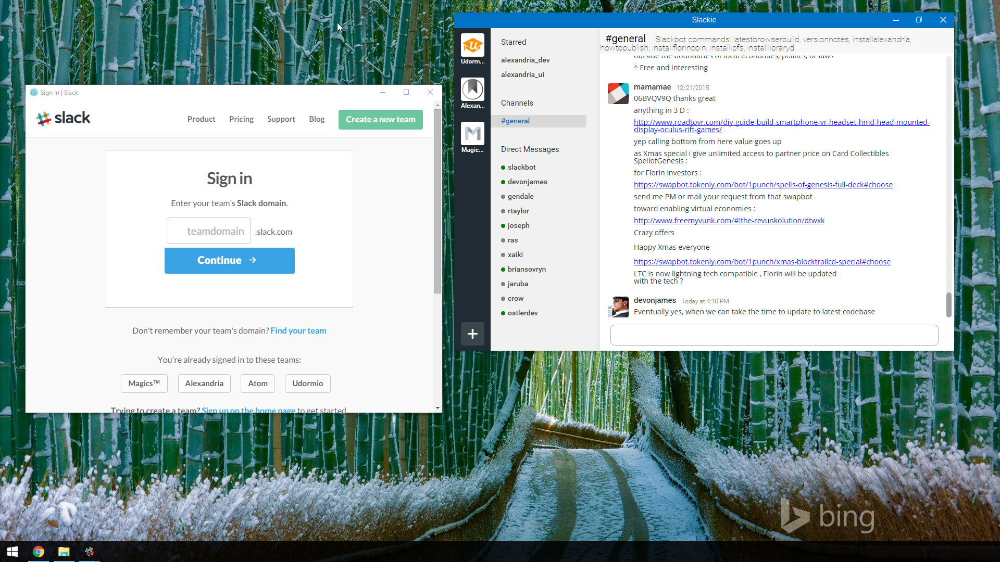

#Slackie

 
 
 

### Screenshots

## Contributing

### Getting Started

- `npm install`

To run the app in development:

- `npm start`

Running `npm start` will download and install [Electron](http://electron.atom.io/).

### Building & Release

- `npm run release`

### Find a bug/issue or simply want to request a new feature?

[Create a Github issue/feature request!](https://github.com/luigiplr/slackie/issues/new)

## Copyright and License

Code released under the [GPLv3](LICENSE).

